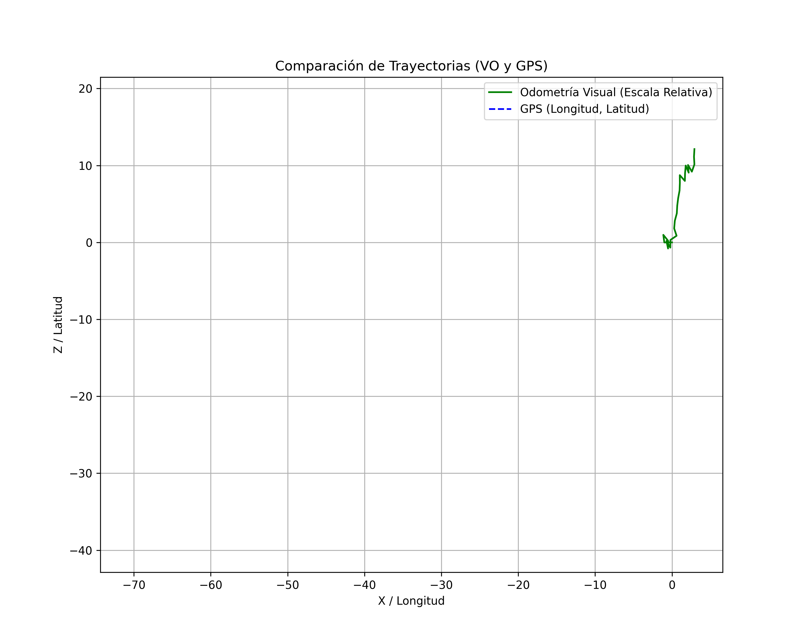

# tatxas

Felipe Pereirak SSGL rentzat egindako "tachas" lanen aurrerapen guztiak biltzen ditu. Praktika profesionaleko ikaslea.

# tachas

Almacén de avances digitales con código de las "tachas" de Felipe Pereira para la Empresa SSGL. Estudiante de práctica profesional.

---

## 🚀 Tecnologías utilizadas

- **Python 3.12**  
- **OpenCV**  
- **Folium**  
- **Pandas**  
- **NumPy**  
- **Matplotlib**  
- **Jupyter Notebook**  
- **HTML5** (para mapas interactivos)  
- **PyTorch** (detección de objetos, modelos `.pt`)  
- **Git** (control de versiones)  

---

## 📁 Estructura del proyecto

```
.
├── *.py                # Scripts principales de análisis y visualización
├── captaPT/            # Modelos de detección (PyTorch)
├── tachasPT/           # Resultados de detección de tachas
├── PkPT/               # Modelos de detección (PyTorch)
├── NNPT                # Resultados de detección de patrones de tachas
├── mapas_dinamicos/    # Mapas HTML generados dinámicamente
├── metadata/           # Metadatos y archivos auxiliares
├── screenshots/        # Capturas de pantalla de resultados
├── videos/             # Videos fuente y procesados
├── README.md           # Este archivo
└── fecha_actual - Análisis FP SSGL.xlsx # Almacena toda la info. más importante de los análisis de detección y el entrenamiento de la NN
```

---

## 📦 Instalación rápida

1. Clona este repositorio:
   ```sh
   git clone https://github.com/tu_usuario/tatxas.git
   cd tatxas
   ```
2. Instala las dependencias:
   ```sh
   pip install -r requirements.txt
   ```
   > Si no existe `requirements.txt`, instala manualmente:  
   > `pip install opencv-python folium pandas numpy matplotlib torch`

---

## 🛠️ Uso básico

Ejecuta cualquier script Python según el análisis que desees realizar, por ejemplo:
```sh
python code31.py
```
Los resultados se guardarán en las carpetas correspondientes.

---

## 📬 Contacto

Felipe Pereira  
[LinkedIn](https://www.linkedin.com/in/felipe-pereira-alarc%C3%B3n/) | [Email](mailto:f.pereiraalarcn@gmail.com)

---

<p align="center">
  
</p>